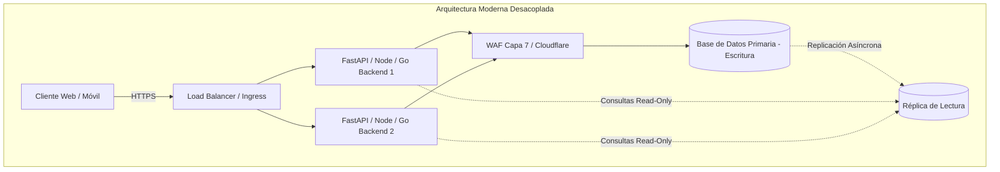
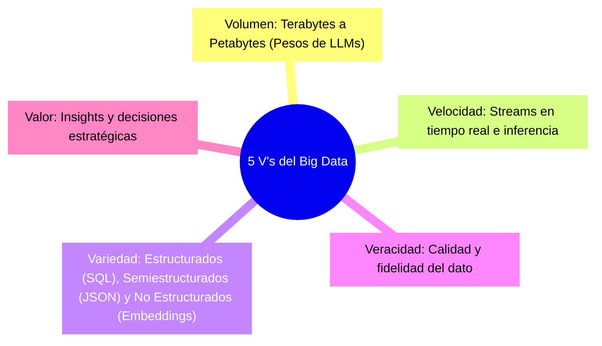
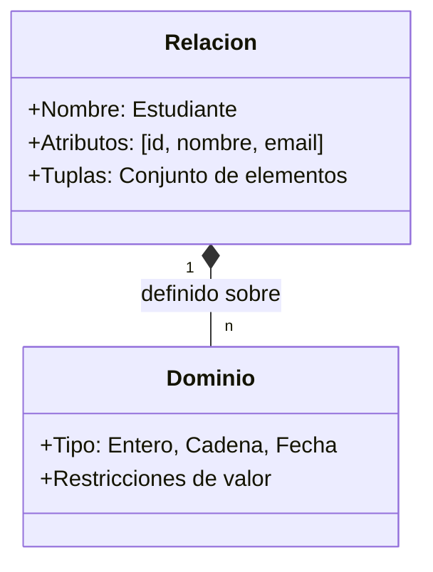

## 1. De Monolitos a Infraestructuras Distribuidas: ¿Dónde Vive la Base de Datos?

Uno de los puntos de partida de la clase fue entender cómo ha cambiado el rol de la base de datos a medida que la arquitectura de software ha evolucionado.

### La transición histórica
1. **Monolitos Tradicionales (Patrón MVC):** En aplicaciones con frameworks como Django, Symfony o Laravel, el servidor web, la lógica de negocio y la capa de acceso a datos coexistían en una sola unidad de despliegue que realizaba consultas directas a un motor como MySQL o PostgreSQL.
2. **Arquitecturas Desacopladas y Microservicios:** Hoy separamos clientes (SPAs, apps móviles) de APIs stateless (FastAPI, Go, Node.js) orquestadas en clusters de Kubernetes. Aquí, la base de datos se convierte en el núcleo de estado compartido más crítico.
3. **Alta Disponibilidad y Rendimiento:** Se discutió cómo esquemas de réplicas *Master-Replica* y bases de datos distribuidas (ej. AWS Aurora o CockroachDB) permiten tolerar fallos y distribuir cargas de lectura, mientras que el diseño ineficiente de una consulta (por ejemplo, un `JOIN` mal estructurado) puede colapsar servidores enteros

> [!NOTE]
> Un mal diseño relacional no se soluciona agregando más CPU o memoria (escalabilidad vertical). La optimización del modelo, la indexación adecuada y el orden lógico de las operaciones son indispensables.

---

## 2. Del Dato a la Información en la Era del Big Data y la IA

Algo fundamental en la primera sesión fue delimitar la frontera entre **Dato**, **Información** y **Conocimiento**:

| Concepto | Definición | Ejemplo |
| :--- | :--- | :--- |
| **Dato** | Valor aislado o símbolo bruto sin contexto intrínseco. | `1803` |
| **Información** | Conjunto de datos organizados y contextualizados con significado útil. | `1803 es el año de fundación de la Universidad de Antioquia.` |
| **Conocimiento** | Información procesada, comprendida y aplicada para la toma de decisiones. | `La UdeA tiene más de 220 años de historia académica en la región.` |

### La explosión del Big Data y la Inteligencia Artificial
Analizamos cómo las **5 V's del Big Data** (Volumen, Velocidad, Variedad, Veracidad y Valor) han cobrado una nueva dimensión con los modelos de lenguaje (LLMs) y la IA generativa:

Hoy no solo almacenamos registros tabulares; la infraestructura debe soportar **bases de datos vectoriales** (para búsquedas semánticas y arquitecturas RAG), almacenamiento de tensores y gestión de flujos de datos a escala global.

---

## 3. Seguridad, Marco Legal y Disponibilidad de Datos

En la segunda sesión se revisó el marco regulatorio colombiano y las consideraciones de ciberseguridad que todo ingeniero debe tener presente al diseñar esquemas de datos:

### Marco Legal en Colombia
- **Ley 1581 de 2012 (Régimen General de Protección de Datos Personales / Hábeas Data):** Exige autorización explícita para el tratamiento de datos sensibles, principios de finalidad y mecanismos de rectificación/eliminación.
- **Ley 1273 de 2009 (Delitos Informáticos):** Tipifica el acceso abusivo a sistemas informáticos, la interceptación de datos y el daño a bases de datos.
- **Ley 527 de 1999 (Comercio Electrónico y Firmas Digitales):** Consagra el principio de *neutralidad tecnológica* y la validez probatoria de los mensajes de datos y firmas electrónicas.

### Ciberseguridad y Mitigación
- **Ataques de Denegación de Servicio (DoS / DDoS):** Agotamiento de conexiones de base de datos (connection pool exhaustion), saturación de memoria o CPU mediante consultas costosas no indexadas.
- **Cross-Site Scripting (XSS) e Inyección SQL:** Vulnerabilidades en capa de aplicación que comprometen la integridad de la base de datos.
- **Defensa en Profundidad:** Implementación de **WAF (Web Application Firewall)** en Capa 7 (ej. AWS WAF, Cloudflare) y parametrización estricta de consultas.

---

## 4. Fundamentos Matemáticos del Modelo Relacional

El modelo relacional, propuesto por **Edgar F. Codd en 1970**, se fundamenta en la teoría de conjuntos y la lógica de predicados de primer orden.

### Conceptos formales:

1. **Dominio ($D$):** Es un conjunto homogéneo y atómico de valores válidos.
   $$\text{dom}(\text{Edad}) = \{ x \in \mathbb{Z} \mid 0 \le x \le 120 \}$$

2. **Producto Cartesiano ($D_1 \times D_2 \times \dots \times D_n$):** El conjunto de todas las $n$-tuplas ordenadas posibles.
   $$D_1 \times D_2 = \{ (d_1, d_2) \mid d_1 \in D_1 \land d_2 \in D_2 \}$$

3. **Relación ($R$):** Matemáticamente, una relación es un subconjunto del producto cartesiano de uno o más dominios:
   $$R \subseteq D_1 \times D_2 \times \dots \times D_n$$
   En términos de bases de datos, $R$ es una **tabla**, cada elemento $(d_1, \dots, d_n) \in R$ es una **tupla** (fila) y cada columna representa un **atributo**.

### Reglas de Integridad y Claves Candidatas
Para garantizar la consistencia en el modelo relacional, definimos:
- **Clave Candidata ($K$):** Subconjunto de atributos de una relación $R$ que satisface dos propiedades formales:
  1. **Unicidad:** No existen dos tuplas distintas $t_1, t_2 \in R$ tales que $t_1[K] = t_2[K]$.
  2. **Minimalidad (Irreductibilidad):** Ningún subconjunto propio de $K$ cumple la condición de unicidad. Si eliminamos un atributo de $K$, pierde la propiedad de identificar unívocamente a cada tupla.

> [!IMPORTANT]
> Una relación puede tener varias **claves candidatas**. De entre ellas, el diseñador elige una como **Clave Primaria (Primary Key)**, mientras que las restantes se consideran **claves alternas**.

---

## 5. Pregunta de la Semana

> **Pregunta:**  
> ¿Por qué el modelo relacional exige la propiedad de *minimalidad* en la definición de una clave candidata, y qué diferencia a una superclave de una clave candidata?
>
> **Respuesta:**  
> Una **superclave** es cualquier conjunto de atributos que permite identificar de forma única cada tupla en una relación (garantiza la *unicidad*), pero puede contener atributos redundantes (por ejemplo, `{id_estudiante, nombre, correo}`).  
> La **clave candidata**, en cambio, es una **superclave mínima**: cumple con la unicidad pero sin atributos sobrantes. La *minimalidad* es crucial porque evita el almacenamiento innecesario de índices, garantiza la eficiencia en las búsquedas y previene anomalías de actualización en las restricciones de integridad referencial.

---

## 6. Reflexión: La Inteligencia Artificial y el Diseño de Bases de Datos

Un punto relevante discutido en clase es el uso de asistentes y agentes de IA (como LLMs). Si bien hoy una IA puede generar un script SQL o sugerir un esquema en segundos:
- El diseño conceptual y la normalización requieren **criterio humano**, comprensión del dominio del negocio y análisis de casos límite.
- Delegar el diseño sin dominar la teoría de conjuntos y el álgebra relacional genera "cajas negras" propensas a cuellos de botella, datos duplicados y fallas de integridad en producción.
- La herramienta de IA debe ser un acelerador y validador, nunca un sustituto del modelado riguroso.

---

## 7. Referencias y Enlaces de Interés

1. 📄 **Codd, E. F. (1970).** *A Relational Model of Data for Large Shared Data Banks*. Communications of the ACM, 13(6), 377–387. [Enlace al paper original en ACM Digital Library](https://dl.acm.org/doi/10.1145/362384.362685).
2. 🏛️ **Secretaría del Senado de Colombia.** *Ley Estatutaria 1581 de 2012: Régimen General de Protección de Datos Personales (Hábeas Data)*. [Texto de la Ley en Función Pública](https://www.funcionpublica.gov.co/eva/gestores/gestor_pagina.php?page=1581-2012).
3. 📖 **Silberschatz, A., Korth, H. F., & Sudarshan, S.** *Database System Concepts (7th Edition)*. McGraw-Hill. [Sitio oficial del libro y recursos](https://www.db-book.com/).
4. 🌐 **CockroachDB Architecture Overview:** *How Modern Distributed SQL Systems Work*. [Documentación Técnica de Cockroach Labs](https://www.cockroachlabs.com/docs/stable/architecture/overview.html).

---

*Publicado por [Mateo Vargas Tirado](https://github.com/araigumadev) como parte del registro de aprendizaje en el curso Bases de Datos 2026/2 - Universidad de Antioquia.*
