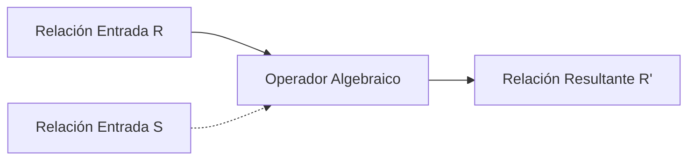
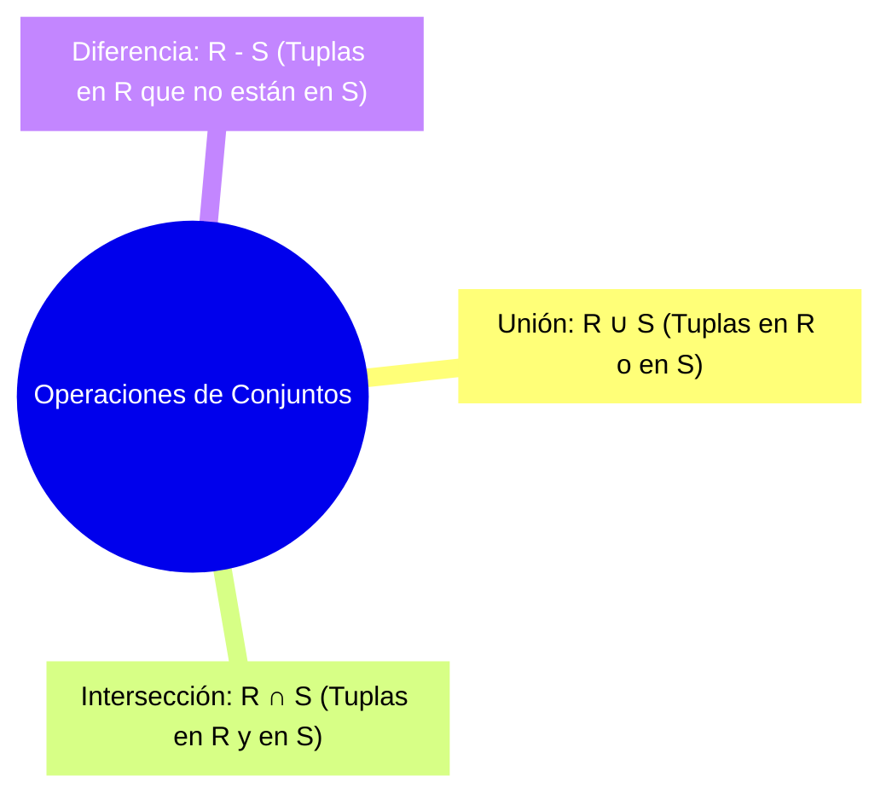
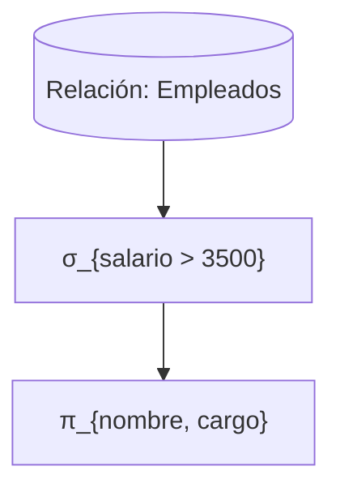
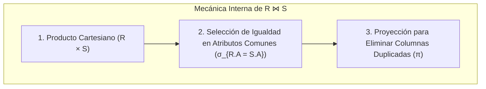
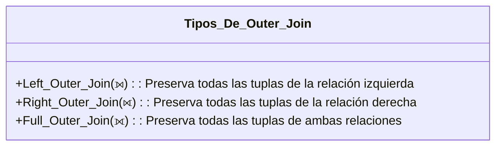
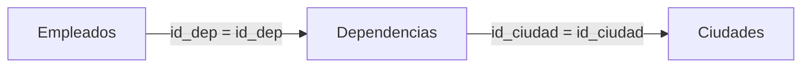
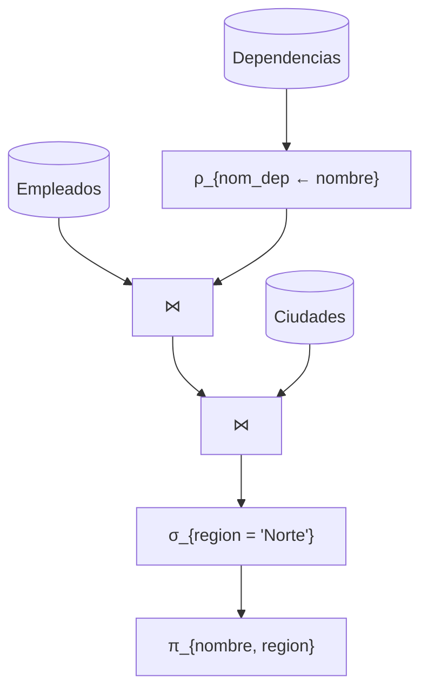

## 1. Fundamentos del Álgebra Relacional y Operadores Unarios

El **Álgebra Relacional** es un lenguaje formal de consultas procedimental propuesto por Edgar F. Codd. Constituye la base matemática y el fundamento teórico sobre el cual operan los motores de bases de datos relacionales (RDBMS) para interpretar, transformar y optimizar consultas.

Una de las propiedades más importantes del álgebra relacional es la **propiedad de cerradura relacional (Closure Property)**: tanto las entradas como las salidas de cualquier operación algebraica son, estrictamente, **relaciones** (conjuntos de tuplas). Esto permite componer y anidar operadores de manera indefinida para construir expresiones complejas.



### Operadores Unarios

Los operadores unarios actúan sobre una única relación base $R$.

#### 1. Selección ($\sigma$)
Filtra tuplas (filas) horizontalmente evaluando una condición lógica o predicado booleano $\theta$ sobre cada tupla $t \in R$:

$$\sigma_{\theta}(R) = \{ t \in R \mid \theta(t) = \text{verdadero} \}$$

El predicado $\theta$ se construye mediante operadores de comparación ($=, \neq, <, \le, >, \ge$) y conectores lógicos ($\land, \lor, \neg$). La selección preserva todos los atributos del esquema original.

```text
-- Ejemplo algebraico:
σ_{salario > 3500 ∧ cargo = 'Gerente'}(Empleados)
```

#### 2. Proyección ($\pi$)
Selecciona un subconjunto vertical de atributos $\{A_1, A_2, \dots, A_k\}$ del esquema de la relación, descartando los demás:

$$\pi_{A_1, A_2, \dots, A_k}(R) = \{ t[A_1, A_2, \dots, A_k] \mid t \in R \}$$

> [!IMPORTANT]
> En la teoría pura de conjuntos del álgebra relacional, la proyección **elimina automáticamente tuplas duplicadas** resultantes. Si al descartar una clave primaria dos tuplas se vuelven idénticas en los atributos proyectados, la relación resultante conservará solo una instancia de dicha tupla.

```text
-- Ejemplo algebraico:
π_{nombre, cargo}(Empleados)
```

#### 3. Renombrado ($\rho$)
Permite cambiar el nombre de una relación, de sus atributos o de ambos simultáneamente. Es indispensable para resolver ambigüedades en consultas compuestas, autorreferenciales o cuando dos relaciones comparten atributos con el mismo identificador:

- Renombrado de relación: $\rho_{S}(R)$ renombra la relación $R$ como $S$.
- Renombrado de atributo: $\rho_{A \to B}(R)$ renombra el atributo $A$ como $B$.
- Renombrado posicional completo: $\rho_{S(B_1, B_2, \dots, B_n)}(R)$.

```text
-- Ejemplo algebraico:
ρ_{nombre_dependencia ← nombre}(Dependencias)
```

| Operador | Símbolo | Dimensión de Filtrado | Esquema Resultante | Equivalente SQL |
| :--- | :---: | :--- | :--- | :--- |
| **Selección** | $\sigma$ | Horizontal (filas / tuplas) | Idéntico al original | Cláusula `WHERE` |
| **Proyección** | $\pi$ | Vertical (columnas / atributos) | Subconjunto de atributos | Cláusula `SELECT DISTINCT` |
| **Renombrado** | $\rho$ | Metadatos (nombres) | Mismo esquema con nuevos alias | Cláusula `AS` |

---

## 2. Operaciones de Teoría de Conjuntos y Compatibilidad de Unión

El álgebra relacional hereda las operaciones clásicas de la teoría de conjuntos. Sin embargo, para aplicar operadores binarios de conjuntos a dos relaciones $R$ y $S$, estas deben cumplir estrictamente con el principio de **Compatibilidad de Unión (Union-Compatibility)**.

### Requisitos de Compatibilidad de Unión:
1. **Mismo Grado (Aridad):** $R$ y $S$ deben tener exactamente el mismo número de atributos: $\text{grado}(R) = \text{grado}(S) = n$.
2. **Dominios Compatibles:** Para cada par posicional de atributos $(A_i, B_i)$, los dominios deben coincidir o ser comparables: $\text{dom}(A_i) = \text{dom}(B_i)$ para todo $i \in \{1, \dots, n\}$.



### Definiciones Formales:

1. **Unión ($R \cup S$):** Conjunto de todas las tuplas que pertenecen a $R$, a $S$ o a ambas, sin duplicados.
   $$R \cup S = \{ t \mid t \in R \lor t \in S \}$$

2. **Intersección ($R \cap S$):** Conjunto de tuplas presentes simultáneamente en $R$ y en $S$. Puede derivarse mediante la diferencia: $R \cap S = R - (R - S)$.
   $$R \cap S = \{ t \mid t \in R \land t \in S \}$$

3. **Diferencia ($R - S$ o $R \setminus S$):** Conjunto de tuplas que pertenecen a $R$ pero no pertenecen a $S$. Esta operación **no es conmutativa** ($R - S \neq S - R$).
   $$R - S = \{ t \mid t \in R \land t \notin S \}$$

---

## 3. Composición de Operadores y Árboles de Evaluación de Consultas

La propiedad de cerradura permite componer operadores de manera anidada. Al ejecutar una expresión compleja, el orden de evaluación sigue una jerarquía funcional de adentro hacia afuera:

$$\pi_{\text{nombre, cargo}}(\sigma_{\text{salario} > 3500}(\text{Empleados}))$$

### Árboles de Evaluación (Query Trees)
Internamente, los sistemas gestores de bases de datos representan cualquier expresión relacional como una estructura jerárquica de árbol:
- **Nodos Hoja:** Representan las relaciones base almacenadas en disco.
- **Nodos Intermedios:** Representan operadores algebraicos ($\sigma, \pi, \bowtie, \rho, \times$).
- **Nodo Raíz:** Produce la relación final resultante devuelta al usuario o aplicación.



### Importancia del Orden y Optimización de Consultas

El orden de los operadores en el árbol impacta drásticamente la viabilidad semántica y el costo computacional de la consulta:

> [!WARNING]
> **Error de Esquema por Inversión de Operadores:**  
> Si se intenta ejecutar $\sigma_{\text{salario} > 3500}(\pi_{\text{nombre, cargo}}(\text{Empleados}))$, el evaluador generará un error de compilación. La proyección $\pi$ elimina el atributo `salario` del esquema intermedio, haciendo imposible que la selección externa $\sigma$ acceda a él para evaluar la condición.

> [!TIP]
> **Heurística de Empuje (Pushing Selections & Projections Down):**  
> Los optimizadores de consultas de motores como PostgreSQL o Oracle reescriben los árboles de consulta para aplicar las selecciones ($\sigma$) y proyecciones ($\pi$) lo más cerca posible de las hojas. Esto reduce drásticamente la cardinalidad (número de tuplas) y el ancho (número de bytes por tupla) antes de ejecutar operaciones costosas como productos cartesianos o joins.

---

## 4. Operadores Binarios y la Familia de Reuniones (Joins)

### 1. Producto Cartesiano ($R \times S$)
Combina cada tupla de $R$ con todas las tuplas de $S$. 
- Si $|R| = m$ y $|S| = n$, la cardinalidad resultante es $|R \times S| = m \cdot n$.
- El grado resultante es $\text{grado}(R \times S) = \text{grado}(R) + \text{grado}(S)$.

$$R \times S = \{ (r_1, \dots, r_n, s_1, \dots, s_m) \mid (r_1, \dots, r_n) \in R \land (s_1, \dots, s_m) \in S \}$$

### 2. Reunión Condicional o Theta Join ($R \bowtie_{\theta} S$)
Combina el producto cartesiano con una selección basada en un predicado $\theta$:

$$R \bowtie_{\theta} S = \sigma_{\theta}(R \times S)$$

Cuando $\theta$ involucra exclusivamente comparaciones de igualdad ($=$), se denomina **Equi-Join**.

### 3. Reunión Natural ($R \bowtie S$)
Es un caso especial de Equi-Join donde:
1. Se realiza la igualdad implícita sobre todos los atributos que comparten el mismo nombre en $R$ y $S$.
2. Se realiza una proyección automática que elimina los atributos duplicados de la relación resultante.

$$R \bowtie S = \pi_{\text{Atributos\_Únicos}}(\sigma_{R.A_1 = S.A_1 \land \dots \land R.A_k = S.A_k}(R \times S))$$



> [!WARNING]
> **Peligro de Colisión de Nombres en el Natural Join:**  
> Si dos relaciones contienen atributos homónimos con semánticas distintas (por ejemplo, `Empleados.nombre` y `Dependencias.nombre`), el Natural Join forzará la igualdad `Empleados.nombre = Dependencias.nombre`, produciendo un conjunto vacío. En estos casos, es obligatorio usar el operador de **Renombrado ($\rho$)** previo a la reunión o recurrir a un Theta Join explícito.

### 4. Reuniones Externas (Outer Joins)
Cuando se requiere conservar tuplas de una o ambas relaciones que no satisfacen la condición de emparejamiento, se recurre a las reuniones externas, rellenando los atributos faltantes con valores nulos (`NULL`):



- **Left Outer Join ($R \mathbin{⟕} S$):** Mantiene todas las tuplas de $R$. Si no hay correspondencia en $S$, sus atributos se llenan con `NULL`.
- **Right Outer Join ($R \mathbin{⟖} S$):** Mantiene todas las tuplas de $S$. Si no hay correspondencia en $R$, sus atributos se llenan con `NULL`.
- **Full Outer Join ($R \mathbin{⟗} S$):** Mantiene todas las tuplas de $R$ y $S$, completando con `NULL` en cualquier dirección cuando no exista correspondencia.

---

## 5. Cadenas de Reunión y Consultas Complejas Multitabla

En esquemas normalizados donde los datos se distribuyen a través de claves foráneas, las consultas algebraicas involucran el encadenamiento de múltiples reuniones:



### Expresión Algebraica Multirrelacional:
Para obtener el nombre y región de los empleados que pertenecen a dependencias ubicadas en la región 'Norte':

$$\pi_{\text{nombre, region}}(\sigma_{\text{region} = '\text{Norte}'}(\text{Empleados} \bowtie \rho_{\text{nom\_dep} \leftarrow \text{nombre}}(\text{Dependencias}) \bowtie \text{Ciudades}))$$

### Árbol de Evaluación Multirrelacional:



---

## 6. Mapeo Sistemático: Álgebra Relacional vs SQL Declarativo

Aunque SQL es un lenguaje declarativo (describe *qué* datos obtener y no *cómo* procesarlos procedimentalmente), cada una de sus cláusulas se traduce directamente en primitivas del álgebra relacional:

| Componente SQL | Primitiva del Álgebra Relacional | Semántica Formal |
| :--- | :---: | :--- |
| `SELECT A1, A2` | $\pi_{A_1, A_2}$ | Proyección vertical |
| `FROM R` | $R$ | Relación base de entrada |
| `WHERE condicion` | $\sigma_{condicion}$ | Selección horizontal (filtrado) |
| `JOIN S ON condicion` | $\bowtie_{condicion}$ | Theta Join / Equi-Join |
| `NATURAL JOIN S` | $\bowtie$ | Reunión Natural implícita |
| `LEFT JOIN S ON ...` | $\mathbin{⟕}$ | Left Outer Join |
| `UNION` | $\cup$ | Unión de conjuntos (elimina duplicados) |
| `EXCEPT` / `MINUS` | $-$ | Diferencia de conjuntos |
| `INTERSECT` | $\cap$ | Intersección de conjuntos |
| `AS alias` | $\rho$ | Renombrado de relaciones / atributos |

> [!NOTE]
> **Set Semantics vs Bag Semantics:**  
> El álgebra relacional clásica opera bajo **semántica de conjuntos** (no permite duplicados). SQL estándar, por razones de rendimiento de inserción y cálculo de agregaciones, opera por defecto bajo **semántica de multiconjuntos (Bag/Multiset Semantics)**. Por ello, la proyección matemática $\pi$ equivale estrictamente a `SELECT DISTINCT` en SQL, mientras que un `SELECT` simple en SQL preserva duplicados.

---

## 7. Pregunta de la Semana

> **Pregunta:**  
> Si SQL es un lenguaje declarativo de alto nivel, ¿por qué los motores de bases de datos transforman internamente las consultas SQL a expresiones del álgebra relacional antes de ejecutarlas?
>
> **Respuesta:**  
> Los motores de bases de datos relacionales convierten el código SQL declarativo en un **Árbol de Álgebra Relacional (Query Tree)** porque el álgebra relacional posee propiedades matemáticas formales (conmutatividad, asociatividad y distributividad de operadores).  
> Gracias a estas leyes de equivalencia algebraica, el **Optimizador de Consultas (Query Optimizer)** puede aplicar transformaciones formales sin alterar el resultado semántico (por ejemplo, conmutar el orden de los joins o empujar selecciones $\sigma$ antes de un producto cartesiano $\times$). Esto permite evaluar múltiples planes lógicos equivalentes, estimar sus costos mediante estadísticas de catálogo y seleccionar el plan de ejecución físico más eficiente en términos de I/O de disco, CPU y memoria RAM.

---

## 8. Reflexión: La Elegancia de la Cerradura Relacional y la Optimización en Motores Modernos

El principio de **cerradura relacional** formulado hace más de cinco décadas sigue siendo uno de los logros más elegantes de la ingeniería de software y la teoría computacional:

1. **Abstracción Desacoplada:** Permite al desarrollador abstraerse de las estructuras de almacenamiento físico (árboles B+, páginas de disco, índices LSM) y razonar exclusivamente sobre transformaciones matemáticas de conjuntos.
2. **Optimización Declarativa Automatizada:** Al no atar la consulta a una rutina imperativa con ciclos `for` o estructuras `if`, el motor retiene el control total para paralelizar ejecuciones, vectorizar instrucciones SIMD o decidir dinámicamente entre algoritmos físicos como *Nested Loop Join*, *Hash Join* o *Merge Join*.
3. **Persistencia en la Era Distribuida:** Motores analíticos modernos para Big Data como Apache Spark (Spark SQL / Catalyst Optimizer) y frameworks de compilación de consultas como Apache Calcite siguen utilizando árboles de álgebra relacional como su representación intermedia fundamental para distribuir cómputo a través de clústeres masivos.

Dominar el álgebra relacional no es un ejercicio meramente académico: es el requisito indispensable para diagnosticar cuellos de botella en planes de ejecución (`EXPLAIN ANALYZE`), diseñar esquemas sin anomalías y escribir consultas SQL de alto rendimiento.

---

## 9. Referencias y Enlaces de Interés

1. 📄 **Codd, E. F. (1972).** *Relational Completeness of Data Base Sublanguages*. In Data Base Systems, Courant Computer Science Symposia Series 6, Prentice-Hall. [Acceso al documento en IBM Research Archive](https://researcher.watson.ibm.com/).
2. 📖 **Silberschatz, A., Korth, H. F., & Sudarshan, S.** *Database System Concepts (7th Edition)*. Chapter 2: Introduction to the Relational Model & Chapter 15: Query Processing. McGraw-Hill. [Sitio web oficial de Database System Concepts](https://www.db-book.com/).
3. 📖 **Garcia-Molina, H., Ullman, J. D., & Widom, J.** *Database Systems: The Complete Book (2nd Edition)*. Prentice Hall.
4. 🌐 **PostgreSQL Global Development Group.** *PostgreSQL Documentation: Chapter 52. Overview of PostgreSQL Internals and Query Processing*. [Documentación Oficial de PostgreSQL](https://www.postgresql.org/docs/current/overview.html).
5. 🛠️ **RelaX - Relational Algebra Calculator.** *Interactive Tool for Relational Algebra Evaluation*. [Plataforma Educativa RelaX (Universitätsverlag Tübingen)](https://dbis-uibk.github.io/relax/).

---

*Publicado por [Mateo Vargas Tirado](https://github.com/araigumadev) como parte del registro de aprendizaje en el curso Bases de Datos 2026/2 - Universidad de Antioquia.*
