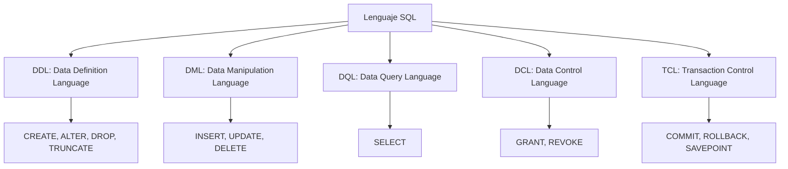
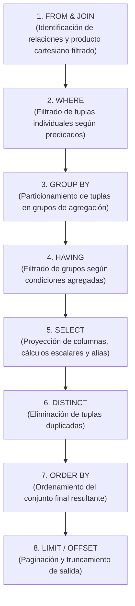
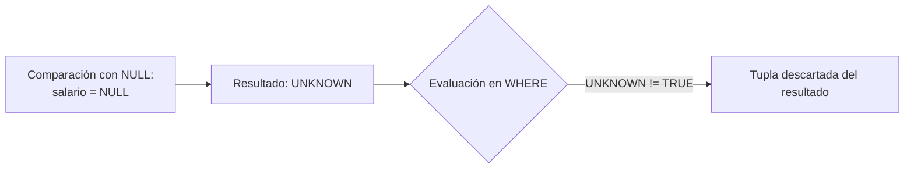
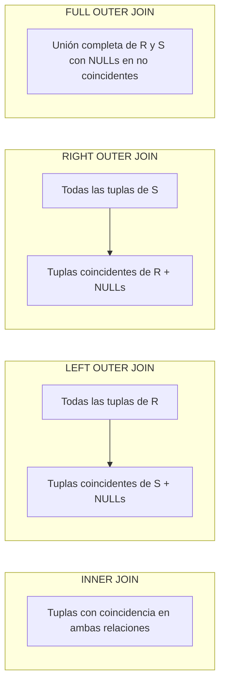
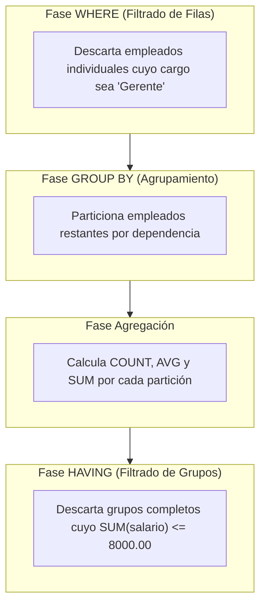
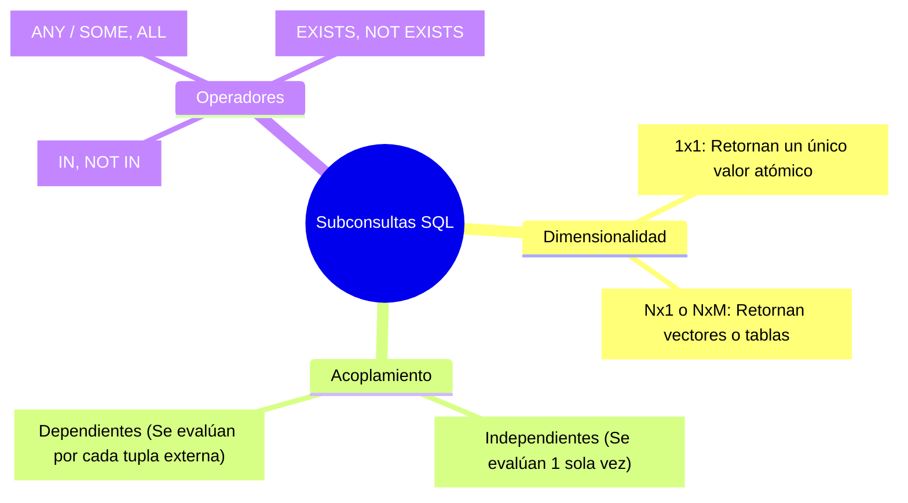
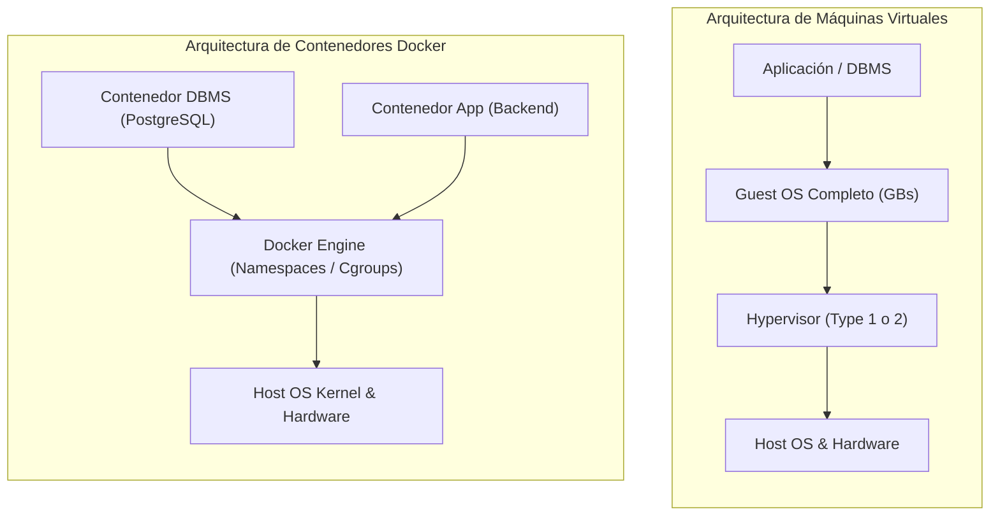

## 1. Taxonomía de SQL y Lenguajes de Definición y Manipulación (DDL y DML)

El lenguaje **SQL (Structured Query Language)** es el estándar declarativo de facto para la definición, manipulación y consulta de datos en Sistemas de Gestión de Bases de Datos Relacionales (RDBMS). A diferencia de los lenguajes imperativos o procedimentales, en SQL el desarrollador especifica **qué** datos desea obtener o transformar, delegando en el optimizador del motor la determinación del **cómo** (el plan de ejecución físico óptimo).

El estándar SQL se subdivide en varios sublenguajes especializados según el dominio de la operación:



### Correspondencia entre SQL, Operaciones CRUD y Protocolo HTTP/REST

En el diseño de arquitecturas de software modernas (e.g. APIs RESTful basadas en microservicios), existe una analogía directa entre las operaciones atómicas de manipulación de datos, el acrónimo CRUD y los métodos del protocolo HTTP:

| Sublenguaje SQL | Operación SQL | Operación CRUD | Método HTTP (REST) | Descripción Técnica |
| :--- | :--- | :--- | :--- | :--- |
| **DML** | `INSERT INTO` | **C**reate | `POST` | Inserta nuevas tuplas en el espacio de almacenamiento de la tabla. |
| **DQL** | `SELECT` | **R**ead | `GET` | Recupera y proyecta tuplas sin alterar el estado persistente. |
| **DML** | `UPDATE` | **U**pdate | `PUT` / `PATCH` | Modifica valores de atributos en tuplas existentes (`PUT` reemplazo total, `PATCH` parcial). |
| **DML** | `DELETE FROM` | **D**elete | `DELETE` | Elimina tuplas que satisfacen un predicado booleano. |

---

### Definición de Esquemas (DDL) y Restricciones de Integridad

El sublenguaje **DDL** permite formalizar la estructura de las relaciones, los tipos de datos asociados a cada dominio y las **restricciones de integridad (Constraints)** que el motor RDBMS debe garantizar de forma transaccional.

```sql
-- Creación de la tabla de dependencias (relación maestra)
CREATE TABLE dependencias (
    dep_cod INTEGER PRIMARY KEY,
    nombre VARCHAR(50) NOT NULL UNIQUE,
    ubicacion VARCHAR(100) DEFAULT 'Sede Central'
);

-- Creación de la tabla de empleados con restricciones de clave foránea y verificación
CREATE TABLE empleados (
    cedula VARCHAR(15) PRIMARY KEY,
    nombre VARCHAR(50) NOT NULL,
    cargo VARCHAR(30) NOT NULL,
    salario NUMERIC(10, 2) NOT NULL,
    comision NUMERIC(10, 2),
    fecha_ingreso DATE NOT NULL,
    dep_cod INTEGER NOT NULL,
    CONSTRAINT chk_salario_positivo CHECK (salario > 0),
    CONSTRAINT chk_comision_valida CHECK (comision IS NULL OR comision >= 0),
    CONSTRAINT fk_empleado_dependencia FOREIGN KEY (dep_cod) 
        REFERENCES dependencias(dep_cod)
        ON UPDATE CASCADE
        ON DELETE RESTRICT
);
```

#### Catálogo de Restricciones Fundamentales:
1. **`PRIMARY KEY`**: Garantiza simultáneamente unicidad (`UNIQUE`) y obligatoriedad (`NOT NULL`), definiendo el identificador canónico de la relación.
2. **`FOREIGN KEY ... REFERENCES`**: Asegura la **Integridad Referencial**, impidiendo la existencia de tuplas huérfanas y gobernando acciones en cascada (`ON DELETE RESTRICT / CASCADE / SET NULL`).
3. **`UNIQUE`**: Restringe la existencia de valores duplicados en atributos que conforman claves candidatas alternas.
4. **`NOT NULL`**: Prohíbe la inserción de estados desconocidos o indefinidos (`NULL`) en el atributo.
5. **`CHECK (predicado)`**: Evalúa un predicado booleano sobre los valores de la tupla antes de permitir una operación de inserción o modificación.
6. **`DEFAULT valor`**: Inyecta un valor determinista si la sentencia `INSERT` omite la columna.

> [!IMPORTANT]
> **Trade-off de Diseño**: La implementación de reglas de negocio críticas (como integridad referencial y rangos de datos) a nivel de base de datos (`CHECK`, `FOREIGN KEY`) garantiza consistencia universal independiente del cliente o lenguaje de backend. Sin embargo, reglas de negocio sumamente dinámicas o sujetas a cambios frecuentes pueden generar acoplamiento y migraciones complejas de esquemas si se colocan rígidamente en el DDL.

---

### Manipulación de Datos (DML)

Las operaciones DML transforman el estado de la base de datos dentro de un contexto transaccional:

```sql
-- Inserción individual de registros
INSERT INTO dependencias (dep_cod, nombre, ubicacion)
VALUES (10, 'Tecnología e Infraestructura', 'Bloque 21');

-- Inserción posicional múltiple
INSERT INTO empleados (cedula, nombre, cargo, salario, comision, fecha_ingreso, dep_cod)
VALUES 
    ('1001', 'Laura Gómez', 'Ingeniero de Datos', 4500.00, 500.00, '2023-01-15', 10),
    ('1002', 'Carlos Pérez', 'Administrador DBA', 5200.00, NULL, '2022-06-01', 10);

-- Actualización condicional de atributos
UPDATE empleados
SET salario = salario * 1.08,
    comision = COALESCE(comision, 0) + 100.00
WHERE dep_cod = 10 AND cargo = 'Ingeniero de Datos';

-- Eliminación condicional de tuplas
DELETE FROM empleados
WHERE cedula = '1002';
```

> [!WARNING]
> Las sentencias `UPDATE` y `DELETE` sin cláusula `WHERE` operan sobre **la totalidad de las tuplas de la relación**, lo que puede ocasionar pérdida de datos irrecuperable en entornos que no operen en modo transaccional seguro (`AUTOCOMMIT = OFF`).

---

## 2. Procesamiento y Pipeline de Evaluación Lógica de Consultas (DQL)

Una de las discrepancias conceptuales más comunes al aprender SQL es la diferencia entre el **orden sintáctico (léxico)** de escritura de una consulta y su **orden de evaluación lógico** dentro del motor relacional.



### Implicaciones de este Orden de Evaluación:
- **Disponibilidad de Alias**: Un alias definido en la cláusula `SELECT` (e.g. `SELECT salario * 12 AS salario_anual`) **no puede ser referenciado en la cláusula `WHERE` ni en `GROUP BY`**, dado que `WHERE` y `GROUP BY` se evalúan en las fases 2 y 3, antes de que `SELECT` cree el alias en la fase 5.
- **Acceso a `ORDER BY`**: La cláusula `ORDER BY` sí puede utilizar alias definidos en `SELECT`, pues se procesa en la fase 7.

---

### Lógica Trivaluada (3VL) y Manejo Formal de `NULL`

En el modelo relacional clásico propuesto por Edgar F. Codd, el valor `NULL` representa un estado especial: la **ausencia de valor**, valor desconocido o no aplicable. En consecuencia, SQL opera bajo una **Lógica Trivaluada (Three-Valued Logic - 3VL)** cuyos posibles estados de verdad son:

$$\mathbb{B}_3 = \{ \text{TRUE}, \text{FALSE}, \text{UNKNOWN} \}$$



#### Tablas de Verdad en Lógica Trivaluada

| $P$ | $Q$ | $P \land Q$ | $P \lor Q$ | $\neg P$ |
| :---: | :---: | :---: | :---: | :---: |
| **TRUE** | **TRUE** | TRUE | TRUE | FALSE |
| **TRUE** | **FALSE** | FALSE | TRUE | FALSE |
| **TRUE** | **UNKNOWN** | UNKNOWN | TRUE | FALSE |
| **FALSE** | **FALSE** | FALSE | FALSE | TRUE |
| **FALSE** | **UNKNOWN** | FALSE | UNKNOWN | TRUE |
| **UNKNOWN** | **UNKNOWN** | UNKNOWN | UNKNOWN | UNKNOWN |

#### Comportamiento de `NULL` en Cálculos y Predicados:
1. Cualquier operación aritmética directa sobre un `NULL` produce `NULL`:
   $$\text{salario} + \text{NULL} \implies \text{NULL}$$
2. Cualquier comparación relacional tradicional con `NULL` produce `UNKNOWN`:
   $$\text{comision} = \text{NULL} \implies \text{UNKNOWN}$$
3. Para evaluar la presencia o ausencia de nulos se debe utilizar sintaxis especializada:
   - `IS NULL` / `IS NOT NULL`
   - `COALESCE(val1, val2, ..., valN)` (estándar SQL ANSI, retorna el primer valor no nulo)
   - `IFNULL(val, default)` (disponible en motores como SQLite y MySQL)

```sql
-- Manejo robusto de nulos en cálculos de compensación total
SELECT 
    cedula,
    nombre,
    salario,
    COALESCE(comision, 0) AS comision_ajustada,
    salario + COALESCE(comision, 0) AS compensacion_total
FROM empleados
WHERE comision IS NOT NULL OR salario > 4000.00;
```

---

## 3. Operaciones de Combinación Relacional (Joins) en SQL

Las operaciones de Join materializan el producto cartesiano restringido ($\sigma_{\theta}(R \times S)$) o las extensiones de preservación externa del álgebra relacional.



### 1. `INNER JOIN` (Reunión Interna)
Retorna exclusivamente las tuplas que satisfacen el predicado de enlace en ambas relaciones:

$$\text{Empleados} \bowtie_{\text{dep\_cod}} \text{Dependencias}$$

```sql
SELECT 
    E.cedula,
    E.nombre AS empleado,
    E.cargo,
    D.nombre AS departamento
FROM empleados E
INNER JOIN dependencias D ON E.dep_cod = D.dep_cod;
```

### 2. `LEFT OUTER JOIN` (Reunión Externa Izquierda)
Preserva **todas** las tuplas de la relación izquierda ($R$). Si una tupla de $R$ no tiene correspondencia en la relación derecha ($S$), los atributos proyectados de $S$ se completan con valores `NULL`:

$$\text{Dependencias} \mathbin{⟕}_{\text{dep\_cod}} \text{Empleados}$$

```sql
SELECT 
    D.dep_cod,
    D.nombre AS departamento,
    E.cedula,
    E.nombre AS empleado
FROM dependencias D
LEFT JOIN empleados E ON D.dep_cod = E.dep_cod;
```

### 3. Patrón Anti-Join (Detección de Tuplas Huérfanas / Diferencia Relacional)
El `LEFT JOIN` combinado con un predicado `IS NULL` sobre la clave primaria de la tabla derecha implementa algebraicamente la operación de diferencia de conjuntos ($R - S$):

```sql
-- Obtener dependencias que NO tienen empleados asignados
SELECT 
    D.dep_cod,
    D.nombre AS departamento_sin_personal
FROM dependencias D
LEFT JOIN empleados E ON D.dep_cod = E.dep_cod
WHERE E.cedula IS NULL;
```

---

## 4. Agregación, Agrupamiento y Resumen Estadístico de Datos

Las funciones de agregación operan sobre colecciones de tuplas pertenecientes a una partición para producir un único valor escalar resumen por grupo:

$$\mathcal{G}_{\text{funciones}}(\text{Relación})$$

### Catálogo de Funciones de Agregación:
- `COUNT(*)`: Computa el número total de tuplas físicas en el grupo, **incluyendo tuplas con atributos en `NULL`**.
- `COUNT(columna)`: Computa el número de tuplas donde `columna` posee un valor **estrictamente distinto de `NULL`**.
- `COUNT(DISTINCT columna)`: Computa el número de valores únicos no nulos.
- `SUM(columna)` / `AVG(columna)`: Suma aritmética y promedio aritmético (ignoran valores `NULL`).
- `MIN(columna)` / `MAX(columna)`: Extremos del dominio ordenado.

> [!IMPORTANT]
> **Diferencia Fundamental entre `COUNT(*)` y `COUNT(columna)`**:
> Si una relación tiene 14 tuplas y 10 de ellas poseen `comision = NULL`, `COUNT(*)` retornará `14`, mientras que `COUNT(comision)` retornará `4`.

---

### Cláusulas `GROUP BY` y `HAVING`

La cláusula `GROUP BY` segmenta el conjunto de tuplas resultante de las fases anteriores (`FROM` y `WHERE`) en particiones disjuntas según los valores de los atributos de agrupación.

```sql
SELECT 
    D.nombre AS departamento,
    COUNT(E.cedula) AS total_empleados,
    ROUND(AVG(E.salario), 2) AS salario_promedio,
    SUM(E.salario) AS total_nomina
FROM dependencias D
INNER JOIN empleados E ON D.dep_cod = E.dep_cod
WHERE E.cargo <> 'Gerente'
GROUP BY D.dep_cod, D.nombre
HAVING SUM(E.salario) > 8000.00
ORDER BY total_nomina DESC;
```



#### Regla de Oro de Proyección en Agregaciones:
En una consulta con `GROUP BY`, cualquier atributo que figure en la cláusula `SELECT` **debe** cumplir una de dos condiciones:
1. Estar presente explícitamente en la lista de columnas de la cláusula `GROUP BY`.
2. Estar encapsulado dentro de una función de agregación (`COUNT`, `SUM`, `AVG`, `MIN`, `MAX`).

| Criterio | Cláusula `WHERE` | Cláusula `HAVING` |
| :--- | :--- | :--- |
| **Momento de Ejecución** | Fase 2 (Previo al agrupamiento) | Fase 4 (Posterior a la agregación) |
| **Elemento de Filtrado** | Tuplas individuales del dataset | Grupos / particiones completas |
| **Funciones de Agregación** | **Prohibidas** (e.g. `WHERE AVG(salario) > 1000` es un error de sintaxis) | **Permitidas y esperadas** (`HAVING AVG(salario) > 1000`) |

---

## 5. Subconsultas (Nested Queries) y Predicados Cuantificados

Una **subconsulta** es una sentencia `SELECT` anidada dentro de otra consulta principal (externa). Se clasifican según su dimensionalidad y su nivel de acoplamiento con la consulta contenedora.



### 1. Subconsultas Escalares
Retornan un único valor escalar ($1 \times 1$) y pueden utilizarse en cualquier lugar donde se espere una constante o expresión:

```sql
-- Empleados que perciben un salario superior al salario promedio global
SELECT 
    cedula,
    nombre,
    salario
FROM empleados
WHERE salario > (SELECT AVG(salario) FROM empleados);
```

### 2. Subconsultas de Conjunto con Operadores Cuantificados (`IN`, `ALL`, `ANY`)

- **Operador `IN`**: Verifica pertenencia a un conjunto $\{v_1, v_2, \dots, v_k\}$.
- **Operador `> ALL`**: Evalúa si el valor es estrictamente mayor que **todos** los elementos devueltos por la subconsulta (equivalente a $> \max(\dots)$).
- **Operador `> ANY` / `> SOME`**: Evalúa si el valor es mayor que **al menos uno** de los elementos devueltos por la subconsulta (equivalente a $> \min(\dots)$).

```sql
-- Empleados cuyo salario supera al de TODOS los empleados del departamento 20
SELECT 
    cedula,
    nombre,
    salario
FROM empleados
WHERE salario > ALL (
    SELECT salario 
    FROM empleados 
    WHERE dep_cod = 20
);
```

### 3. Subconsultas Correlacionadas y Predicado `EXISTS`
En una subconsulta correlacionada, la consulta interna hace referencia a atributos de la tupla evaluada actualmente por la consulta externa ($E_{ext}$):

```sql
-- Identificar empleados que ganan más que el promedio de SU PROPIO departamento
SELECT 
    E_ext.cedula,
    E_ext.nombre,
    E_ext.dep_cod,
    E_ext.salario
FROM empleados E_ext
WHERE E_ext.salario > (
    SELECT AVG(E_int.salario)
    FROM empleados E_int
    WHERE E_int.dep_cod = E_ext.dep_cod
);
```

> [!TIP]
> El operador `EXISTS (subquery)` evalúa si la subconsulta produce al menos una tupla. Tan pronto el optimizador del motor encuentra la primera coincidencia, cortocircuita la evaluación (`Early Termination`), lo que suele otorgar un rendimiento superior a `IN` sobre conjuntos voluminosos con nulos.

---

## 6. Entornos de Ejecución, Motores RDBMS y Contenedorización con Docker

El desarrollo moderno con bases de datos relacionales exige dominar tanto las herramientas de interacción por línea de comandos (CLI) como las arquitecturas de virtualización liviana.

### Comparativa de Motores Relacionales

| Característica | SQLite | PostgreSQL | MySQL / MariaDB |
| :--- | :--- | :--- | :--- |
| **Arquitectura** | Embebida / Serverless (In-process) | Cliente-Servidor multihilo/multiproceso | Cliente-Servidor |
| **Almacenamiento** | Archivo único en disco (`.db`, `.sqlite`) | Cluster de almacenamiento gestionado por daemon | Motores pluggables (InnoDB) |
| **Tipado de Datos** | Dinámico / Type Affinity | Estricto, extensible (JSONB, Arrays, UUID) | Estricto por configuración |
| **Caso de Uso Óptimo** | Testing, dispositivos móviles, notebooks | Sistemas transaccionales complejos, analítica | Aplicaciones web estándar |

---

### Arquitectura de Contenedores Docker para Motores de Bases de Datos

Frente a la virtualización pesada tradicional (Máquinas Virtuales con hipervisor que duplican sistemas operativos completos), **Docker** aprovecha los mecanismos nativos del kernel Linux (*Namespaces* y *Control Groups - cgroups*) para aislar procesos en **contenedores ligeros** que comparten el mismo kernel.



#### Despliegue de un Servidor PostgreSQL Aislado con Docker

```bash
# Descargar imagen y ejecutar contenedor PostgreSQL con persistencia y mapeo de puertos
docker run -d \
  --name rdbms-postgres-udea \
  -e POSTGRES_DB=academia_db \
  -e POSTGRES_USER=dbadmin \
  -e POSTGRES_PASSWORD=SecretPassword123! \
  -p 5432:5432 \
  -v pgdata_volume:/var/lib/postgresql/data \
  postgres:16-alpine
```

#### Comandos Clave para Administración por CLI:
- **Inspección interactiva (`psql`)**:
  ```bash
  # Abrir sesión interactiva dentro del contenedor
  docker exec -it rdbms-postgres-udea psql -U dbadmin -d academia_db
  ```
- **Metacomandos esenciales en PostgreSQL CLI (`psql`)**:
  - `\l` : Lista todas las bases de datos en el cluster.
  - `\dt` : Lista las relaciones (tablas) del esquema actual.
  - `\d nombre_tabla` : Inspecciona la estructura detallada, tipos, restricciones e índices de una relación.
  - `\q` : Finaliza la sesión interactiva.

---

## 7. Pregunta de la Semana

> **Pregunta:**  
> ¿Por qué una condición basada en una función de agregación (por ejemplo, `WHERE AVG(salario) > 3000`) es sintácticamente inválida en la cláusula `WHERE`, y cuál es la diferencia en el costo computacional entre filtrarla mediante `HAVING` o mediante una subconsulta escalar en el `WHERE`?
>
> **Respuesta:**  
> La razón radica estrictamente en el **pipeline de evaluación lógica de SQL**. La cláusula `WHERE` se ejecuta en la **Fase 2**, instante en el cual las tuplas se evalúan de manera individual antes de cualquier particionamiento o consolidación. Dado que las funciones de agregación (`AVG`, `SUM`, etc.) requieren la totalidad de las tuplas de un grupo para computar su resultado, el motor aún no dispone de dicho valor en la fase `WHERE`.
>
> Respecto al costo computacional:
> 1. **Filtrado con `HAVING`**: Opera sobre particiones generadas por un `GROUP BY`. Requiere clasificar u ordenar todas las tuplas de entrada, calcular los agregados por cada grupo y luego descartar los grupos no deseados.
> 2. **Subconsulta Escalar en `WHERE`** (e.g. `WHERE salario > (SELECT AVG(salario) FROM empleados)`): La subconsulta no correlacionada se ejecuta **una única vez** al inicio, produciendo un valor constante ($c$). Luego, el `WHERE` evalúa la condición simple `salario > c` en un solo escaneo lineal ($\mathcal{O}(N)$) o mediante una búsqueda indexada ($\mathcal{O}(\log N)$), evitando crear estructuras intermedias de agrupamiento en memoria si solo se requería comparar tuplas individuales contra un umbral global.

---

## 8. Reflexión: La Brecha de Impedancia y el Paradigma Declarativo en Entornos Cloud-Native

El aprendizaje de SQL pone de manifiesto la clásica **brecha de impedancia objeto-relacional (Object-Relational Impedance Mismatch)**. Los desarrolladores habituados a paradigmas imperativos (Java, Python, C#) tienden inicialmente a pensar en bucles `for`, mutabilidad e iteraciones secuenciales registro por registro. Sin embargo, SQL opera bajo el **paradigma declarativo basado en la teoría de conjuntos y lógica de predicados**, donde el procesador de consultas evalúa transformaciones masivas sobre colecciones inmutables de tuplas.

Forzar al motor relacional a operar de forma secuencial (por ejemplo, mediante cursores o llamadas repetitivas desde la capa de aplicación para emular un join) degrada severamente el rendimiento, anulando las optimizaciones de álgebra relacional que el optimizador de costos (CBO) ejecuta internamente.

Asimismo, la convergencia entre RDBMS y tecnologías de contenedorización como **Docker** ha democratizado el aislamiento de entornos. Hoy en día, la infraestructura de datos no se concibe como servidores físicos monolíticos instalados manualmente, sino como piezas declarativas de infraestructura como código (IaC), donde los contenedores permiten orquestar réplicas de lectura, bases de datos efímeras para pruebas de integración automatizadas y migraciones reproducibles en pipelines de CI/CD.

---

## 9. Referencias y Enlaces de Interés

1. **International Organization for Standardization (ISO)**: *ISO/IEC 9075:2023 - Information technology — Database languages — SQL*. [Acceso en ISO Standards Catalogue](https://www.iso.org/standard/76583.html).
2. **PostgreSQL Global Development Group**: *PostgreSQL 16 Documentation: The SQL Language & Query Processing*. [https://www.postgresql.org/docs/current/tutorial-sql.html](https://www.postgresql.org/docs/current/tutorial-sql.html).
3. **Codd, E. F. (1979)**: *Extending the Database Relational Model to Capture More Meaning*. ACM Transactions on Database Systems (TODS), 4(4), 397–434. [https://doi.org/10.1145/320107.320109](https://doi.org/10.1145/320107.320109).
4. **Docker Documentation**: *Container Architecture, Storage Volumes and Persistent Data in RDBMS*. [https://docs.docker.com/storage/volumes/](https://docs.docker.com/storage/volumes/).
5. **Silberschatz, A., Korth, H. F., & Sudarshan, S. (2020)**: *Database System Concepts* (7th ed.). McGraw-Hill Education.

---

*Publicado por [Mateo Vargas Tirado](https://github.com/araigumadev) como parte del registro de aprendizaje en el curso Bases de Datos 2026/2 - Universidad de Antioquia.*
